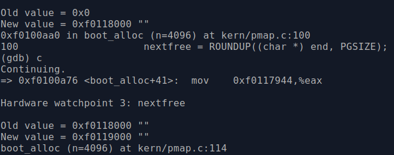

TP1: Memoria virtual en JOS
===========================

boot_alloc_pos
--------------
1. Un cálculo manual de la primera dirección de memoria que devolverá boot_alloc() tras el arranque. Se puede calcular a partir del binario compilado (obj/kern/kernel), usando los comandos readelf y/o nm y operaciones matemáticas.

Al correr `boot_alloc()` inicialmente voy a obtener *nextfree*
Ejecutando `nm -n kernel`, se obtienen los simbolos ordenados segun como aparecen en memoria.

El símbolo end aparece en la posición `0xf0117950`, en base a ese valor se podrá calcular *nextfree* (donde termina el kernel).
Al hacer `boot_alloc()` se obtendrá la siguiente libre, pasandole la dirección `0xf0117950`. Previamente se lo redondea al múltiplo de 4096 (tamaño de página) más cercano obteniendo `0xf0118000`. Sumo una página (para obtener la siguiente libre) llegando a la direccion: `0xf0118000 + 0x1000 = 0xf0119000`

Corrida con finish, mostrando el resultado final obtenido coincide con el manual

Corrida con Watch, mostrando que pasa de `0xf0118000` a `0xf0119000`

page_alloc
----------

1. Responder: ¿en qué se diferencia `page2pa()` de `page2kva()`?    
Tanto `page2pa()` como `page2kva()` reciben una página física, se diferencian en que `page2pa()` devuelve la dirección física con tipo `physaddr_t` y `page2kva()` retorna la dirección virtual con tipo `void*`. `page2kva()` internamente llama a `page2pa()` y luego pasa la dirección física a `KADDR()` que devuelve la dirección virtual.

map_region_large
----------------

1. ¿cuánta memoria se ahorró de este modo? (en KiB)     

Cada Page Table Entry ocupa 4 kb, al igual que las page directory entrys. Al pasar de página chica a *large*, ya no es necesaria la *page table entry*. Por lo que se podría decir que lo que se ahorra por página es 4 KB o 3.90625 Kib.
    
 
 
2. ¿es una cantidad fija, o depende de la memoria física de la computadora?    

La cantidad será fija, ya que sin importar la memoria física de la computadora, el PGSIZE no varía, es 4KB. Además esta modificación solo afecta la forma en que se traducen las direcciones de virtual a física.

 

