TP2: Procesos de usuario
========================

env_alloc
---------

`ENVGENSHIFT = 12` entonces `1 << ENVGENSHIFT = 1 << 12 = 4096` y `NENV = 1 << LOG2NENV = 1 << 10 = 1024` entonces `~(NENV - 1) = -1023`. 
generation es el `env_id` que traía más `4096 & -1023` para despues hacer un *or* un offset entre la posicion que ocupa el env actual (`struct Env *e`) y el arreglo de envs (`struct Env *envs`).

Según la consigna, en base hexadecimal quedaría:

* 4096 = 1000
* 1023 = 03FF

</br>

Entonces el *and* da 4096 o 1000 en hexadecimal y al hacer el *or* le voy a sumar el offset. De esta manera los primeros 5 valores van a ser (en hexadecimal):

* 4096 = 1000
* 4096 + 1 = 1001 
* 4096 + 2 = 1002
* 4096 + 3 = 1003 
* 4096 + 4 = 1004

En *env_init()* cuando los inicializo en el ciclo *for* coloco en cero los *env_id*, entonces no los tengo en cuenta y para este caso va a ser siempre 1000 + offset.


El proceso que se va a lanzar será 4096 más el offset 630, en hexadecimal: `1000 + 276 = 1276`. El proximo va a ser igual pero ahora el `env_id` del proceso anterior será `1276`. De esta manera se tendrá `(1276 + 1000) or 276 = 2276`. El siguiente igual pero ahora el id_previo es `2276` entonces `(2276 + 1000) or 276 = 3276` y así sucesivamente. En hexadecimal para las primeras 5 iteraciones quedará de la siguiente manera:

* 1276
* 2276
* 3276
* 4276
* 5276


...


env_init_percpu
---------------
 luego de la syscall.
A `lgdt` le paso como parámetro `gdt_pd = { sizeof(gdt) - 1, (unsigned long) gdt }`

`sizeof(gdt) = 6 bytes`, se puede ver a continuación el tamaño del struct de acuerdo a las direcciones donde escribe

```
struct Segdesc gdt[] = {
	// 0x0 - unused (always faults -- for trapping NULL far pointers)
	SEG_NULL,

	// 0x8 - kernel code segment
	[GD_KT >> 3] = SEG(STA_X | STA_R, 0x0, 0xffffffff, 0),

	// 0x10 - kernel data segment
	[GD_KD >> 3] = SEG(STA_W, 0x0, 0xffffffff, 0),

	// 0x18 - user code segment
	[GD_UT >> 3] = SEG(STA_X | STA_R, 0x0, 0xffffffff, 3),

	// 0x20 - user data segment
	[GD_UD >> 3] = SEG(STA_W, 0x0, 0xffffffff, 3),

	// 0x28 - tss, initialized in trap_init_percpu()
	[GD_TSS0 >> 3] = SEG_NULL
}

```

Los bytes representan el tamaño y direccion de la GDT.

...


env_pop_tf
----------

```

struct Trapframe {
	struct PushRegs tf_regs;
	uint16_t tf_es;
	uint16_t tf_padding1;
	uint16_t tf_ds;
	uint16_t tf_padding2;
	uint32_t tf_trapno;
	/* below here defined by x86 hardware */
	uint32_t tf_err;
	uintptr_t tf_eip;
	uint16_t tf_cs;
	uint16_t tf_padding3;
	uint32_t tf_eflags;
	/* below here only when crossing rings, such as from user to kernel */
	uintptr_t tf_esp;
	uint16_t tf_ss;
	uint16_t tf_padding4;
} __attribute__((packed));

```


* `%0` hace referencia a un operando (el primero), en este caso es el que se pasa por parámetro: `tf`. Entonces el tope de la pila justo antes de `popal` tiene el puntero tf (direccion a la que apunta).
* `popal` restaura todos los registros. `popl` popea el stack, esto se hace 2 veces. Luego se le suma `0x8` (`/* skip tf_trapno and tf_errcode */`). Con este último comentario se puede asumir que el tope de la pila va a contener a `uintptr_t tf_eip`.
* Los siguientes tres elementos serán  `tf_cs`, `tf_padding3` y `tf_eflags` será el tercer elemento antes de ejecutarse `iret`.


</br>
</br>

De la función `env_alloc()`
```
	// Set up appropriate initial values for the segment registers.
	// GD_UD is the user data segment selector in the GDT, and
	// GD_UT is the user text segment selector (see inc/memlayout.h).
	// The low 2 bits of each segment register contains the
	// Requestor Privilege Level (RPL); 3 means user mode.  When
	// we switch privilege levels, the hardware does various
	// checks involving the RPL and the Descriptor Privilege Level
	// (DPL) stored in the descriptors themselves.
	e->env_tf.tf_ds = GD_UD | 3;
	e->env_tf.tf_es = GD_UD | 3;
	e->env_tf.tf_ss = GD_UD | 3;
	e->env_tf.tf_esp = USTACKTOP;
	e->env_tf.tf_cs = GD_UT | 3;
	// You will set e->env_tf.tf_eip later.

```

Para determinar el nivel se ven los 2 bits más bajos. X86 lo hace en los de `tf_cs`. Para ver si hubo un cambio de ring compara los 2 bits más bajos de `tf_cs` y `%cs` (actual): si son iguales no hubo cambio, si difieren es que hubo un cambio en el nivel de privilegio

...


gdb_hello
---------

1. Poner un breakpoint en env_pop_tf() y continuar la ejecución hasta allí. </br> </br>
2. En QEMU, entrar en modo monitor (Ctrl-a c), y mostrar las cinco primeras líneas del comando info registers. </br> 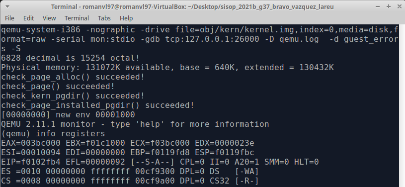 </br> </br>
3. De vuelta a GDB, imprimir el valor del argumento tf. </br> 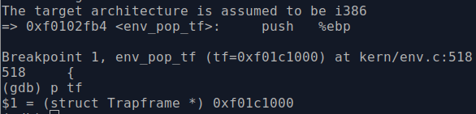 </br> </br>
4. Imprimir, con x/Nx tf tantos enteros como haya en el struct Trapframe donde N = sizeof(Trapframe) / sizeof(int). </br> 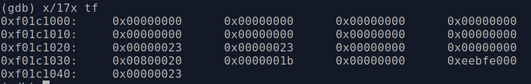 </br> </br>
5. Avanzar hasta justo después del movl ...,%esp, usando si M para ejecutar tantas instrucciones como sea necesario en un solo paso. </br> 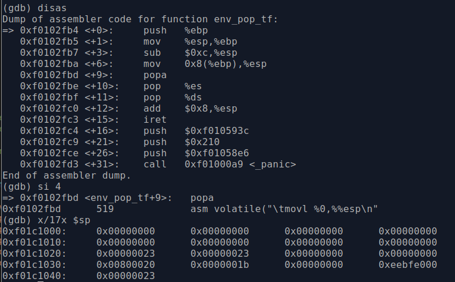 </br> </br>
6.  Comprobar, con x/Nx $sp que los contenidos son los mismos que tf (donde N es el tamaño de tf). Se observa en imágenes de punt 5 y 4 </br> </br>
7.  Describir cada uno de los valores. Para los valores no nulos, se debe indicar dónde se configuró inicialmente el valor, y qué representa.  Mostrar en este punto, de nuevo, las cinco primeras líneas de info registers en el monitor de QEMU. Explicar los cambios producidos. </br> </br> 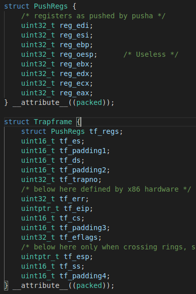 </br> </br>  Se puede observar que los primeros 8 son los del `struct PushRegs` (primer elemento de `struct TrapFrame`) que se encuentran todos en cero. Luego viene `tf_es` con un valor de 0x23 y `tf_ds` con 0x23 tambíén (ignoro padding). El valor 0x23 apunta al segmento de memoria. Luego viene `tf_trapno` y `tf_err` en 0x0. `tf_eip` tiene un valor de 0x00800020, correspondiente al lugar de retorno. Luego viene `tf_cs` cuyos 2 últimos bits indican el ring donde se encuentra el proceso, el valor es 0x1b, si se toman los últimos 2 bits se obtiene el 11 o 0x3 (modo usuario). Luego viene `tf_eflags` en 0x0, `tf_esp` en 0xeebfe000 que indica que valor tomará el registro %esp al retornar. Finalmente `tf_ss` tiene el valor 0x23. El DPL de ES pasó a valer 3 y ek DPL de cs vale 0.
8.Continuar hasta la instrucción iret, sin llegar a ejecutarla. </br>  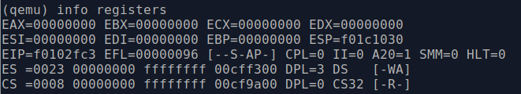 </br> </br>
9. Ejecutar la instrucción iret. En ese momento se ha realizado el cambio de contexto y los símbolos del kernel ya no son válidos. 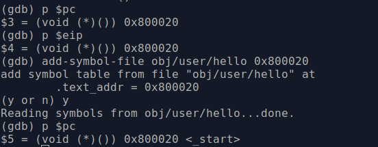 </br> 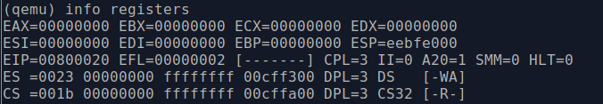 </br> </br> Se observa que el DPL de cs ahora vale 3 (user mode)
10. Poner un breakpoint temporal (tbreak, se aplica una sola vez) en la función syscall() y explicar qué ocurre justo tras ejecutar la instrucción int $0x30. Usar, de ser necesario, el monitor de QEMU. 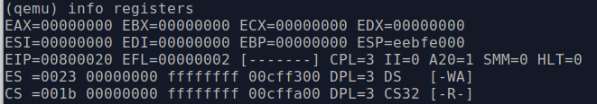 </br> 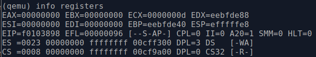 </br> </br> Se observa que el DPL de cs pasa de valer 3 a 0.


...

kern_idt
---------

...

A continuación procedemos a responder las preguntas solicitadas en el enunciado

1)¿Cómo decidir si usar TRAPHANDLER o TRAPHANDLER_NOEC? ¿Qué pasaría si se usara solamente la primera?

Para saber si se debe usar TRAPHANDEL o TRAPHANDLER_NOEC, se debe tener en cuenta cada excepción/interrupcion. Si cuando se produce una excepción/interrupción la CPU procede a realizar un push al stack del codigo del error se utiliza TRAPHANDEL. Por el contrario si no se realiza un push del codigo del error se usa TRAPHANDLER_NOEC.
Si solo utilizara TRAPHANDLER, cuando la CPU no realiza un push del codigo de error, el trap frame quedaría distinto, y se generarian errores.

...

2)¿Qué cambia, en la invocación de handlers, el segundo parámetro (istrap) de la macro SETGATE? ¿Por qué se elegiría un comportamiento u otro durante un syscall?

Según el valor que tome el parametro istrap de la macro SETGATE se definira el comportamiento del manejo del problema.

* istrap=0: Cuando istrap toma este valor se esta tratando con una interrupción por lo cual se resetea el valor de IF lo que hace que las interrupciones sean deshabilitadas. De esta manera se evita que otras interrupciones obstaculizen el manejo de la primera interrupción.

* istrap = 1: Cuando istrap toma este valor se esta trantando con una execpción no se modifica el valor IF.


 3) Leer user/softint.c y ejecutarlo con make run-softint-nox. ¿Qué interrupción trata de generar? ¿Qué interrupción se genera? Si son diferentes a la que invoca el programa… ¿cuál es el mecanismo por el que ocurrió esto, y por qué motivos? ¿Qué modificarían en JOS para cambiar este comportamiento?

 Si ejecutamos por consola make run-softint-nox, la misma nos devuelve:

 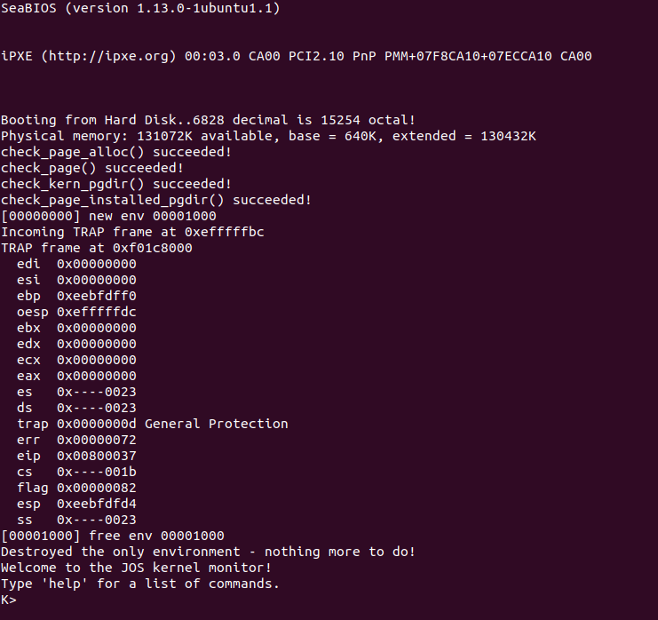

Como podemos observar en la imagen anterior se genero una excepción del tipo General Protection, la exepción que debiamos haber obtenido según user/softint.c es Page Fault (asm volatile("int $14");// page fault).
La interrupción llamada en sofint.c es la interrupción numero 14, cuando la misma fue declarada en el archivo trap.c se lo hizo de tal forma que solo puede ser lanzada en modo kernel. Y como el archivo user/sofint.c se ejecuta en modo usuario, fue lanzada la execepciṕm General Protection.
El procesador utiliza un mecanismo para controlar en que modo pueden lanzarse las interrupciones, este control se realiza mediante los campos DPL (indica el nivel de privilegio del segmento) y CPL (indica el nivel de privilegio del procedimiento).

...

user_evilhello
---------

...

Cuando ejecutamos la versión de evilhello.c brindada en el codigo del tp2 obtenemos lo siguiente:

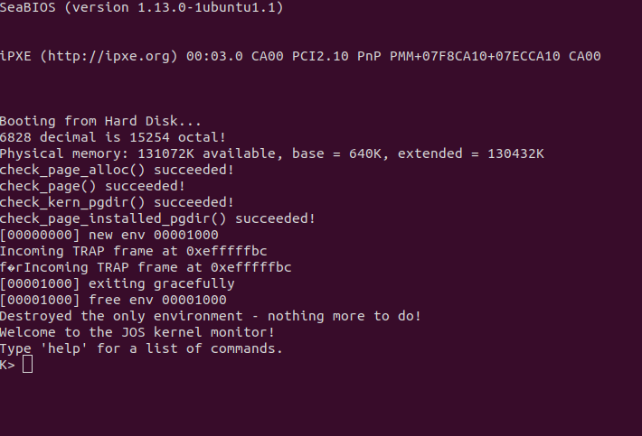

Mientras que cuando ejecutamos la versión dada por el enunciado la salida es:

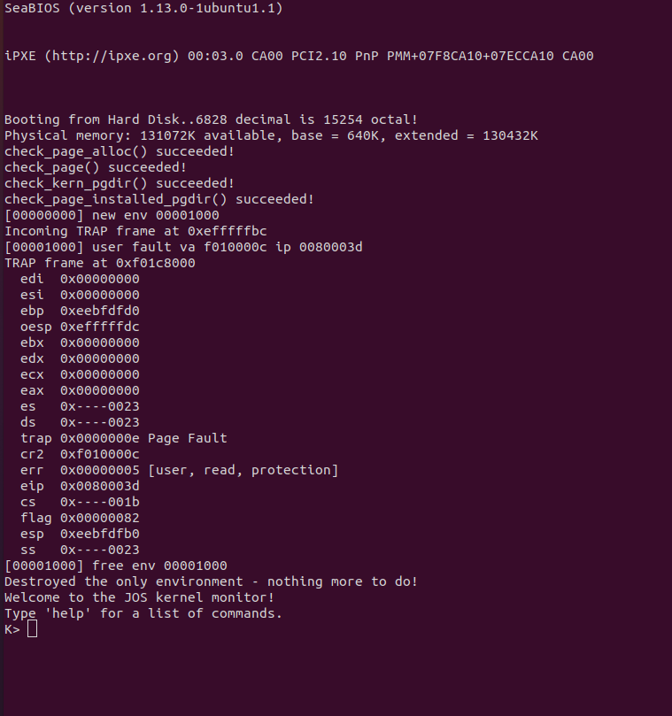

En el codigo de evilhello.c del tp2  se le pasa como parametro a sys_cputs la dirección 0xf010000c, esta es una dirección de memoria invalida ya que es una dirección de memoria del kernel.
En la segunda versión se le pasa una dirección valida, esto sucede ya que la variable first se encuentra declarada en el stack del proceso, pero el contenido de la variable es una memoria invalida, ya que como digimos previamente 0xf010000c pertenece al kernel.

La versión original del codigo lograra ejecutarse correctamente esto se debe a que no esta implementada un proteccion de memoria durante un syscall, ya que la dirección sera accedida en modo kernel dentro del handler de la syscall no se da un Page Fault.
En cambio en la segunda version se tratara de acceder a la dirección en modo usuario y por eso se obtiene un Page Fault.


