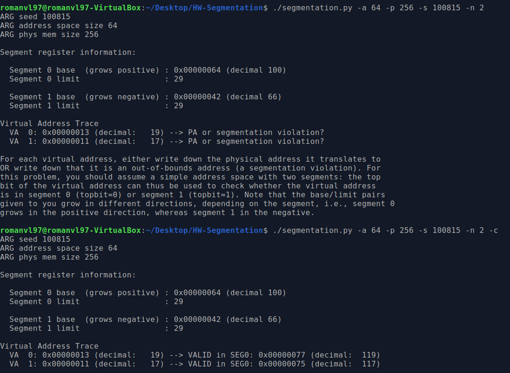
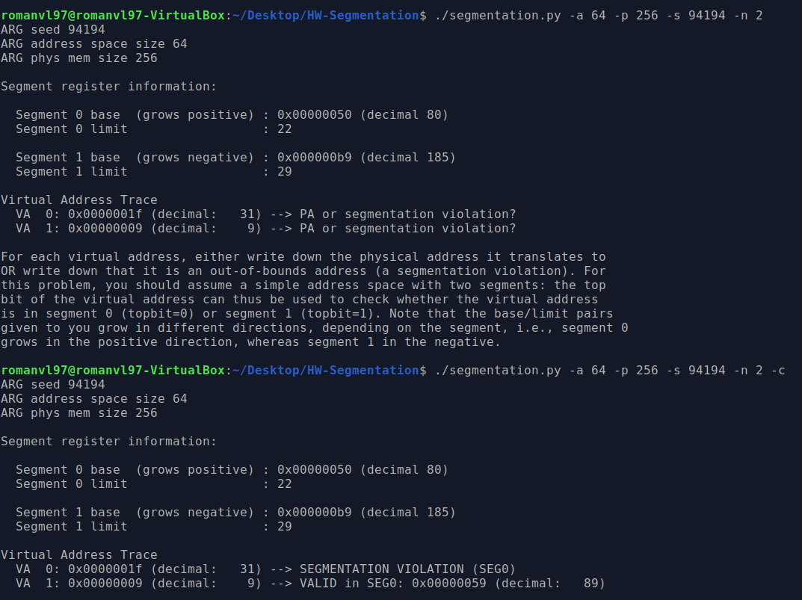
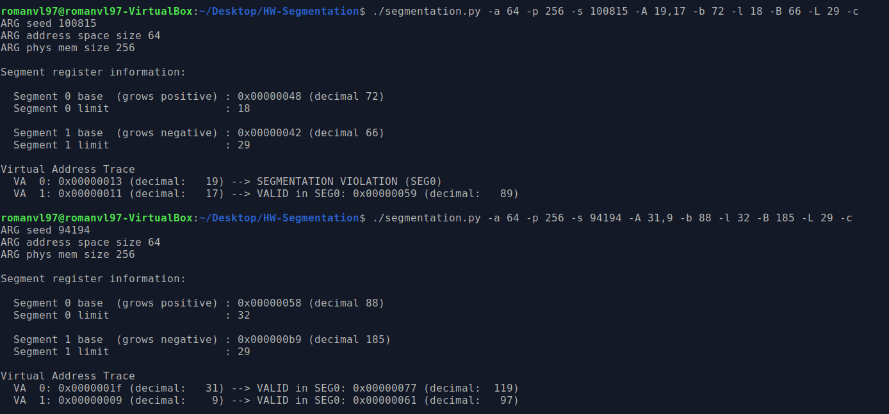

CORRIDA 1 
</br>
| SEGMENTO | Base | Bound |
|----------|------|-------|
|0         | 100  | 29    |
|1         | 66   | 29    |
</br> 

```
addres space virtual -> 64 -> 6 bits
```

</br>

```
VA 0: 0x13 (19) -> 0x13 (010011) -> topbit = 0 -> segment 0 -> 100 + 19 = 119 > 129 ? NO -> PA: 0x77 (119) 

VA 1: 0x11 (17) -> 0x11 (010001)  -> topbit = 0 -> segment 0 -> 100 + 17 = 117 > 129 ? NO -> PA: 0x75 (117)
```

</br>



CORRIDA 2
</br>
| SEGMENTO | Base | Bound |
|----------|------|-------|
|0         | 80   | 22    |
|1         | 185  | 29    |
</br>

```
VA 0: 0x1f (31) -> 0x1f (011111) -> topbit = 0 -> segmento 0 -> 80 + 31 = 121 > 102 ? SI -> SEG VIO

VA 1: 0x09 (9) -> 0x09 (001001) -> topbit = 0 -> segmento 0 -> 9 + 80 = 89 > 102 ? NO -> PA: 0x59 (89)
```

</br>



</br>

| Corrida Original | VA0                       | VA1           |
|------------------|---------------------------|---------------|
|1                 | 19 --> 119                | 17 --> 117    |
|2                 | 31 --> Segmentatio Fault  | 9 --> 89      |


</br>

| Corrida Modificada | VA0                        |          VA1 |
|--------------------|----------------------------|--------------|
|1                   | 19 --> Segmentatio Fault   | 17 --> 89    |
|2                   | 31 --> 119                 | 9 --> 117    |
</br>

Corrida 1 modificada:

</br>

| SEGMENTO | Base | Bound |
|----------|------|-------|
|0         | 72   | 18    |
|1         | 66   | 29    |


</br>

```
VA0: 19 --> 72 + 19 = 91 > 89 ? Si -> Segmentation Fault

VA1: 17 --> 72 + 17 = 89 > 89 ? No -> PA: 89
```

</br>

Corrida 2 modificada:

</br>

| SEGMENTO | Base | Bound |
|----------|------|-------|
|0         | 88   | 32    |
|1         | 185  | 29    |

</br>

```
VA0: 31 -> 31 + 88 = 119 > ? No -> PA:119

VA1: 9 -> 117 (No puedo) 9 + 88 = 97 != 117
```

</br>

Ambas direcciones virtuales caen en segmento 0, tendría que encontrar una base tal que `31 + base = 119` y `9 + base = 117`

</br>




### Tarea: límites de segmentación

1. El tamaño del espacio de direcciones virtuales será $2^5$ y el de físicas $2^7$
2.
3.
4.


